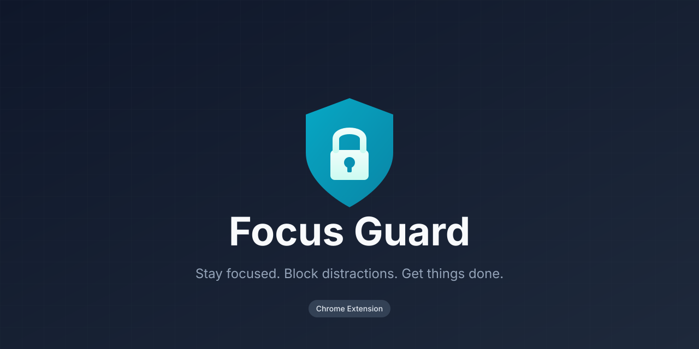

# Focus Guard

Chrome extension that prevents tab switching during video playback or AI chatbot response generation.

**Requirements:** Chrome or Chromium-based browser

## Install

1. Download or clone this repository
2. Open `chrome://extensions/`
3. Enable **Developer mode** (top right)
4. Click **Load unpacked** and select the `focus-guard` folder

## How It Works

When a video is playing or an AI is generating a response, you can't switch tabs. The extension silently keeps you on the locked tab until the action completes.

| Trigger | Behavior |
|---------|----------|
| Video playing | Tab locked (except YouTube Music) |
| AI generating | Tab locked until response completes |
| Tab switch attempt | Instantly returns to locked tab |
| Action completes | Tab automatically unlocks |

## Supported Sites

### Video Detection
Works on any site with `<video>` elements, **except** `music.youtube.com` (so you can listen to music while working).

### AI Chatbots

| Platform | URL |
|----------|-----|
| Claude | `claude.ai` |
| ChatGPT | `chatgpt.com`, `chat.openai.com` |
| Gemini | `gemini.google.com` |
| Perplexity | `perplexity.ai` |
| Grok | `x.com/i/grok`, `grok.x.ai` |
| Google AI Studio | `aistudio.google.com` |

## Detection Methods

The extension uses multiple strategies to detect when AI is generating:

| Method | Description |
|--------|-------------|
| Stop button | Visible only during generation |
| Streaming indicators | DOM elements with streaming/loading classes |
| Disabled inputs | Send button disabled during processing |
| MutationObserver | Watches for DOM changes in real-time |
| Polling fallback | Checks every 300ms as backup |

## Project Structure

```
focus-guard/
├── manifest.json              # Extension configuration
├── background.js              # Tab lock management
├── content-scripts/
│   ├── video-detector.js      # Video playback detection
│   ├── claude-detector.js     # Claude.ai
│   ├── chatgpt-detector.js    # ChatGPT
│   ├── gemini-detector.js     # Gemini
│   ├── perplexity-detector.js # Perplexity
│   ├── grok-detector.js       # Grok
│   └── aistudio-detector.js   # Google AI Studio
└── icons/
    ├── icon16.png
    ├── icon48.png
    └── icon128.png
```

## Troubleshooting

### AI detection not working?

AI platforms frequently update their UI. If detection stops working:

1. Open the AI site and trigger a response
2. Open DevTools (`F12`) → Elements tab
3. Look for the **Stop** button and note its selector
4. Open an issue with the selector info

### Want to add a new AI site?

Create a new detector in `content-scripts/` following the existing pattern:

```javascript
(function() {
  'use strict';
  const POLLING_INTERVAL = 300;
  let lastState = null;

  function isGenerating() {
    // Your detection logic here
    return false;
  }

  function checkAndReport() {
    const generating = isGenerating();
    if (generating !== lastState) {
      lastState = generating;
      chrome.runtime.sendMessage({
        type: 'LOCK_STATE_CHANGED',
        source: 'your-site-name',
        isLocked: generating
      }).catch(() => {});
    }
  }

  // MutationObserver + polling setup...
})();
```

Then add the match pattern to `manifest.json`.

## License

MIT
